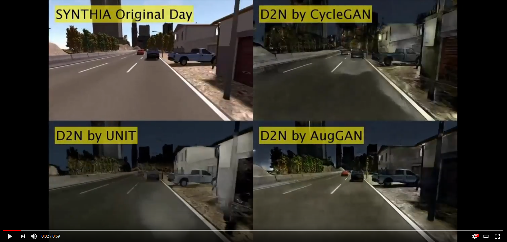

# Semantic preserving image-to-image translation

## Day to Night Style-transfer with Semantic Segmentation Assistant

### Figure 1: Day-to-Night style transfer result comparison
1st row: SYNTHIA input images, 2nd row: cycle-GAN day-to-night output, 3rd row: Aug-GAN day-to-night output;  
4th row: KITTI input images, 5th row: cycle-GAN day-to-night output, 6th row: Aug-GAN day-to-night output.

### Video 1: Sequencial Comparison with cycle-GAN
Left: input sequence, Mid: cycle-GAN output, Right: AugGAN output

## Prerequisite

- Python 3.6+
- `scikit-image`, `tqdm`

